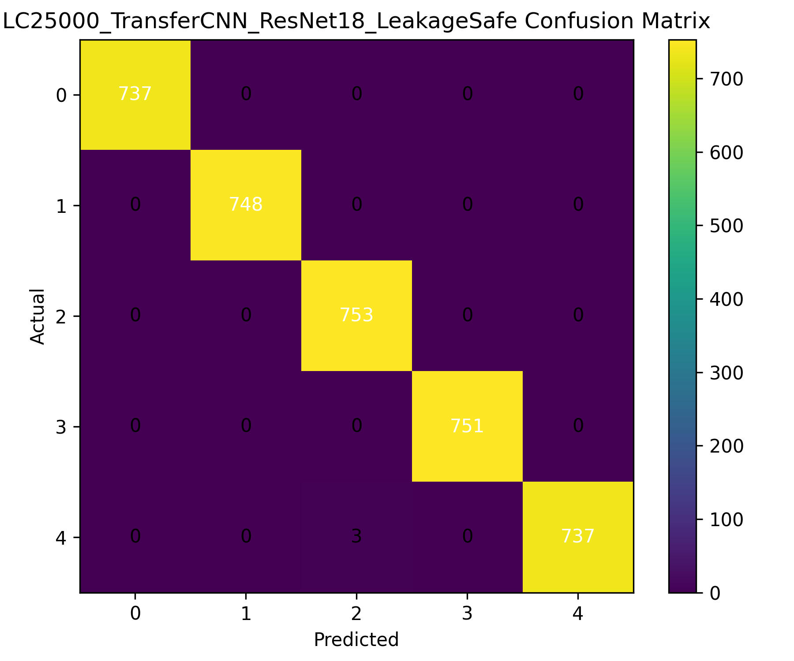
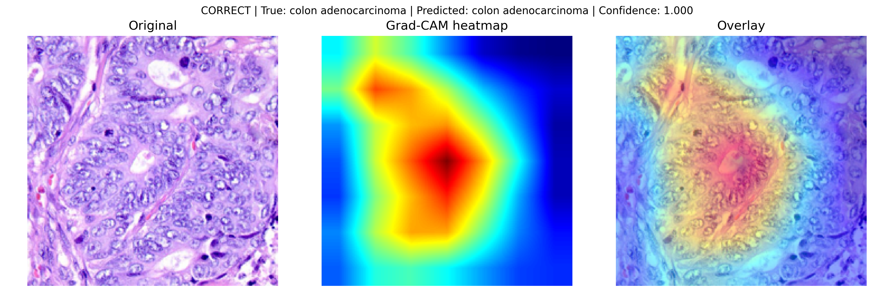
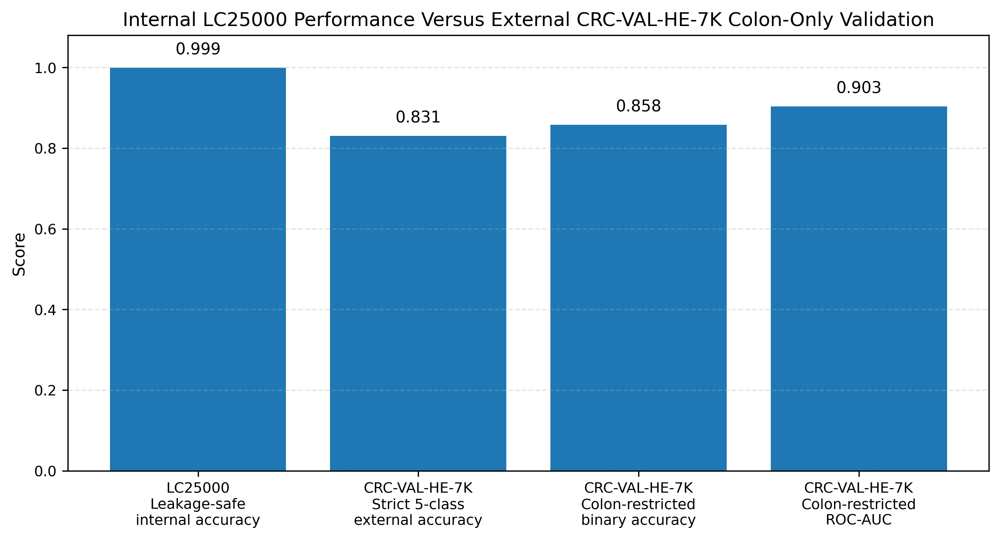

# Leakage-Safe Histopathology Classification on LC25000

[](https://github.com/abhishek04gautam-cpu/lc25000-leakage-safe-histopathology/actions/workflows/ci.yml)

### Duplicate-aware deep-learning evaluation with robustness analysis, explainability and limited external colon validation

This repository contains the code, saved dataset splits, evaluation outputs and supporting artefacts from my MSc Artificial Intelligence dissertation at the University of East London.

The project investigates a key reliability problem in medical-image classification:

> Can duplicate and near-duplicate histopathology image patches produce overly optimistic model-performance estimates?

To address this, the project evaluates classical machine-learning and deep-learning models under progressively stricter experimental protocols:

1. Initial stratified evaluation
2. Exact-duplicate-aware leakage-safe evaluation
3. Near-duplicate-aware grouped evaluation
4. Test-time robustness analysis
5. Calibration and confidence analysis
6. Grad-CAM explainability
7. Limited external colon-only validation

---

## At a Glance

| Area | Summary |
|---|---|
| Problem | Reliable five-class lung and colon histopathology classification |
| Primary dataset | LC25000 — 25,000 histopathology images |
| Models | Logistic Regression, SimpleCNN, ResNet-18, DenseNet-121 and EfficientNet-B0 |
| Reliability focus | Exact-duplicate and near-duplicate-aware evaluation |
| Best leakage-safe result | DenseNet-121 and EfficientNet-B0 achieved 1.0000 rounded accuracy |
| Near-duplicate-safe result | ResNet-18 achieved 0.9992 macro F1 |
| External evaluation | Colon-only CRC-VAL-HE-7K accuracy: 0.8582 |
| Explainability | Grad-CAM |
| Deployment | FastAPI research prototype |
| Technology stack | Python, PyTorch, scikit-learn, OpenCV and FastAPI |

---

## Project Highlights

- Evaluated Logistic Regression, a custom CNN and four transfer-learning configurations
- Compared ResNet-18, DenseNet-121 and EfficientNet-B0 architectures
- Detected exact duplicate overlap using resized-image hashing
- Identified visually similar image relationships using perceptual average hashing
- Created deterministic group-aware train, validation and test splits
- Applied bootstrap confidence intervals and McNemar significance testing
- Evaluated confidence, calibration and temperature scaling
- Used Grad-CAM to inspect correct and misclassified predictions
- Conducted test-time robustness analysis under image perturbations
- Performed limited external colon-only validation using CRC-VAL-HE-7K
- Developed a prototype FastAPI image-classification service
- Preserved saved splits, predictions, metrics and figures for reproducibility

---

## Why This Project Matters

Histopathology datasets often contain image patches derived from larger tissue regions. Images originating from related or overlapping areas may be duplicated or visually similar.

When related patches appear across training and test sets, a model may partly recognise repeated visual patterns instead of learning features that generalise to genuinely independent samples. This can inflate reported accuracy and create misleading confidence in model performance.

This project therefore focuses not only on model accuracy, but also on:

- Data-leakage detection
- Near-duplicate mitigation
- Reproducible evaluation
- Statistical significance
- Model calibration
- Explainability
- Robustness
- External-domain generalisation
- Responsible interpretation of medical-AI results

---

## Research Questions

The experimental framework addresses the following questions:

1. Does the initial LC25000 split contain exact or near-duplicate overlap between training and test data?
2. How does duplicate-aware splitting affect reported model performance?
3. Do high-performing models remain accurate after near-duplicate grouping?
4. Are performance differences between models statistically meaningful?
5. How confident and calibrated are the predictions?
6. Which image regions influence model decisions?
7. How robust is the selected model to realistic image perturbations?
8. How well does an LC25000-trained model transfer to an independent colorectal histology dataset?

---

## Dataset

### LC25000

The primary dataset contains 25,000 histopathology images across five balanced classes:

| Folder | Class |
|---|---|
| `colon_aca` | Colon adenocarcinoma |
| `colon_n` | Colon benign tissue |
| `lung_aca` | Lung adenocarcinoma |
| `lung_n` | Lung benign tissue |
| `lung_scc` | Lung squamous-cell carcinoma |

Images are resized to `224 × 224` RGB inputs for CNN training.

The dataset is not redistributed in this repository. Download it from its original public source and place it under:

```text
datasets/
└── lc25000/
    └── <dataset subdirectories>
        ├── colon_aca/
        ├── colon_n/
        ├── lung_aca/
        ├── lung_n/
        └── lung_scc/
```

The loader searches recursively, so the five class folders may be nested within the downloaded dataset structure.

### External validation dataset

Limited external validation uses the following CRC-VAL-HE-7K classes:

| CRC-VAL-HE-7K class | Evaluation mapping |
|---|---|
| `TUM` | Tumour / LC25000 colon adenocarcinoma |
| `NORM` | Normal / LC25000 colon benign tissue |

This is a **colon-only external validation experiment**. It is not a complete external validation of all five LC25000 classes.

Expected structure:

```text
datasets/
└── crc-val-he-7k/
    └── CRC-VAL-HE-7K/
        ├── NORM/
        ├── TUM/
        └── <other CRC-VAL-HE-7K classes>
```

Alternatively, set the environment variable:

```bash
export CRC_VAL_HE_7K_ROOT="/path/to/CRC-VAL-HE-7K"
```

---

## Evaluation Protocols

### 1. Initial stratified split

The initial experiment used a persisted stratified train, validation and test split.

This protocol provided the starting benchmark but was later audited for cross-split image overlap.

### 2. Leakage-safe split

Exact or effectively identical resized images were grouped before splitting to reduce train-test leakage.

The resulting split contained:

| Partition | Samples |
|---|---:|
| Training | 17,510 |
| Validation | 3,761 |
| Test | 3,729 |

### 3. Near-duplicate-safe split

Perceptual average hashing was used to identify highly similar image relationships. Related images were grouped before assignment to train, validation and test partitions.

The resulting split contained:

| Partition | Samples |
|---|---:|
| Training | 17,480 |
| Validation | 3,745 |
| Test | 3,775 |

### Leakage-audit findings

The audit identified:

- **277 exact resized-image train-test overlaps** in the initial split
- **543 highly similar train-test relationships** at average-hash Hamming distance `≤ 2`

These findings motivated the stricter evaluation protocols.

---

## Models Evaluated

### Classical baseline

#### Logistic Regression

- Images converted to grayscale
- Downsampled to `32 × 32`
- Flattened into feature vectors
- Used as an interpretable non-deep-learning baseline

### Deep-learning models

#### Custom SimpleCNN

A convolutional neural network trained from scratch to provide a deep-learning baseline without pretrained ImageNet features.

#### ResNet-18

A pretrained ResNet-18 model adapted to the five LC25000 classes using staged fine-tuning.

#### ResNet-18 Head-Only Ablation

The pretrained backbone remained frozen while only the classifier head was trained.

This experiment measured the value of deeper backbone fine-tuning.

#### DenseNet-121

A pretrained DenseNet-121 model adapted and fine-tuned for five-class histopathology classification.

#### EfficientNet-B0

A pretrained EfficientNet-B0 model adapted and fine-tuned for the same task.

---

## Training Configuration

Core configuration:

| Parameter | Value |
|---|---|
| Image size | `224 × 224` |
| Random seed | `42` |
| LC25000 batch size | `24` |
| Horizontal flip probability | `0.5` |
| Rotation | `±10°` |
| Normalisation | ImageNet mean and standard deviation |
| Optimiser | AdamW |
| Model-selection metric | Macro F1 |
| Early-stopping patience | `8` |
| Bootstrap repetitions | `1,000` |
| Paired bootstrap repetitions | `2,000` |
| Calibration bins | `10` |

Transfer-learning experiments used staged fine-tuning, allowing deeper layers to be unfrozen after initial classifier training.

---

## Leakage-Safe Results

Results from the resized-image-hash-grouped leakage-safe split:

| Model | Accuracy | Macro F1 | Balanced Accuracy | ROC-AUC |
|---|---:|---:|---:|---:|
| Logistic Regression | 0.5433 | 0.5411 | 0.5430 | 0.8642 |
| SimpleCNN | 0.9901 | 0.9901 | 0.9901 | 0.9998 |
| ResNet-18 Head-Only | 0.9920 | 0.9920 | 0.9920 | 0.9999 |
| ResNet-18 Staged Fine-Tuning | 0.9992 | 0.9992 | 0.9992 | 1.0000 |
| DenseNet-121 | 1.0000 | 1.0000 | 1.0000 | 1.0000 |
| EfficientNet-B0 | 1.0000 | 1.0000 | 1.0000 | 1.0000 |

The transfer-learning models substantially outperformed the classical baseline.

The difference between the head-only and staged ResNet-18 configurations also indicates that fine-tuning deeper pretrained features improved performance.

### Example leakage-safe confusion matrix

<p align="center">
  
</p>

---

## Near-Duplicate-Safe Result

The ResNet-18 model evaluated on the stricter near-duplicate-aware split achieved:

| Metric | Result |
|---|---:|
| Accuracy | 0.9992 |
| Weighted F1 | 0.9992 |
| Macro F1 | 0.9992 |
| Balanced accuracy | 0.9992 |
| ROC-AUC | 1.0000 |
| Test samples | 3,775 |

The continued high performance suggests that LC25000 remains highly separable after duplicate and near-duplicate mitigation.

However, this result must still be interpreted cautiously because the dataset is patch-based rather than patient-based.

---

## Statistical Evaluation

The project includes:

- Bootstrap confidence intervals
- Paired bootstrap comparisons
- McNemar tests
- Per-model prediction files
- Class-level evaluation reports
- Confusion matrices
- ROC curves

These analyses were used to assess whether differences between model predictions were likely to reflect meaningful performance changes rather than random test-sample variation.

Relevant outputs are stored under:

```text
results_summary/leakage_safe/
```

Key files include:

```text
all_leakage_safe_bootstrap_ci_summary.csv
mcnemar_results_leakage_safe.csv
paired_bootstrap_metric_differences_leakage_safe.csv
lc25000_leakage_safe_all_model_summary.csv
```

---

## Calibration and Confidence

High classification accuracy does not necessarily mean that predicted probabilities are reliable.

The project therefore includes:

- Confidence-distribution analysis
- Expected Calibration Error
- Maximum Calibration Error
- Brier score
- Reliability diagrams
- Temperature scaling

Calibration figures are stored under:

```text
figures/calibration/
```

---

## Explainability with Grad-CAM

Grad-CAM was applied to the selected ResNet-18 model to inspect which image regions contributed most strongly to its predictions.

The repository includes examples for:

- Correctly classified images
- Misclassified images
- Multiple tissue classes

### Example Grad-CAM output

<p align="center">
  
</p>

Grad-CAM provides useful qualitative evidence, but it should not be interpreted as proof that the model is using clinically valid pathological features.

---

## Robustness Evaluation

The leakage-safe ResNet-18 model was evaluated under test-time perturbations to examine sensitivity to image-quality changes.

The robustness analysis considered transformations such as changes in:

- Brightness
- Contrast
- Blur
- Noise
- Rotation

Brightness reduction produced the largest observed performance degradation among the tested perturbations.

Robustness outputs are stored under:

```text
results_summary/robustness/
```

---

## Limited External Validation

The leakage-safe ResNet-18 checkpoint was evaluated on `1,974` images from CRC-VAL-HE-7K:

| External class | Samples |
|---|---:|
| TUM | 1,233 |
| NORM | 741 |
| Total | 1,974 |

Two evaluation interpretations were reported.

### Strict five-class evaluation

A prediction was considered correct only when:

- `TUM` was predicted as LC25000 colon adenocarcinoma
- `NORM` was predicted as LC25000 colon benign tissue

| Metric | Result |
|---|---:|
| Strict five-class external accuracy | 0.8308 |
| Non-colon prediction rate | 0.0329 |

### Colon-restricted binary evaluation

Only the two colon-class probabilities were compared:

| Metric | Result |
|---|---:|
| Accuracy | 0.8582 |
| Weighted precision | 0.8609 |
| Weighted recall | 0.8582 |
| Weighted F1 | 0.8545 |
| Macro F1 | 0.8418 |
| Balanced accuracy | 0.8296 |
| ROC-AUC | 0.9032 |

<p align="center">
  
</p>

The decline from internal LC25000 performance to external performance demonstrates the importance of domain shift and independent evaluation.

This experiment is limited to two colorectal classes and must not be presented as full external validation of the five-class model.

---

## Repository Structure

```text
.
├── docs/
│   └── Supporting documentation
│
├── figures/
│   ├── calibration/
│   ├── confusion_matrices/
│   ├── external_validation/
│   ├── gradcam/
│   └── leakage_safe/
│
├── leakage_audit/
│   └── Duplicate and near-duplicate audit artefacts
│
├── results/
│   └── Experimental outputs
│
├── results_summary/
│   ├── external_validation/
│   ├── leakage_safe/
│   ├── near_duplicate_safe/
│   └── robustness/
│
├── saved_splits/
│   └── Persisted train, validation and test indices
│
├── src/
│   ├── data/
│   ├── api.py
│   ├── bootstrap_ci.py
│   ├── calibration_analysis.py
│   ├── confidence_analysis.py
│   ├── config.py
│   ├── data_loader.py
│   ├── dataset.py
│   ├── download_lc25000_dataset.py
│   ├── generate_lc25000_dissertation_figures.py
│   ├── gradcam_lc25000.py
│   ├── imbalance_audit.py
│   ├── lc25000_classical_baseline.py
│   ├── lc25000_external_crc_validation.py
│   ├── lc25000_leakage_audit_v2.py
│   ├── lc25000_leakage_safe_split.py
│   ├── lc25000_sample_grid.py
│   ├── main.py
│   ├── model.py
│   ├── model_efficiency_analysis.py
│   ├── run_lc25000_leakage_safe_evaluation.py
│   ├── statistical_comparison_leakage_safe.py
│   ├── temperature_scaling.py
│   ├── train.py
│   └── visualization.py
│
├── CITATION.cff
├── LICENSE
├── README.md
├── RESULTS_OVERVIEW.md
├── requirements.txt
└── requirements_full.txt
```

---

## Installation

Clone the repository:

```bash
git clone https://github.com/abhishek04gautam-cpu/lc25000-leakage-safe-histopathology.git
cd lc25000-leakage-safe-histopathology
```

Create and activate a virtual environment:

```bash
python -m venv .venv
source .venv/bin/activate
```

On Windows:

```powershell
.venv\Scripts\activate
```

Upgrade pip and install dependencies:

```bash
python -m pip install --upgrade pip
python -m pip install -r requirements.txt
```

`requirements_full.txt` contains the fuller captured development environment.

---

## Dataset Setup

Download or prepare LC25000:

```bash
python src/download_lc25000_dataset.py
```

Alternatively, manually place the dataset under:

```text
datasets/lc25000/
```

Confirm that the following folders can be found recursively:

```text
colon_aca
colon_n
lung_aca
lung_n
lung_scc
```

---

## Running the Experiments

### Compile-check the source files

On macOS or Linux:

```bash
python -m py_compile $(find src -name "*.py")
```

### Run the main experiment pipeline

```bash
python src/main.py
```

### Run the classical baseline

```bash
python src/lc25000_classical_baseline.py
```

### Audit exact and near-duplicate overlap

```bash
python src/lc25000_leakage_audit_v2.py
```

### Create the leakage-safe split

```bash
python src/lc25000_leakage_safe_split.py
```

### Run leakage-safe model evaluations

```bash
python src/run_lc25000_leakage_safe_evaluation.py --model logistic
python src/run_lc25000_leakage_safe_evaluation.py --model simplecnn
python src/run_lc25000_leakage_safe_evaluation.py --model resnet18
python src/run_lc25000_leakage_safe_evaluation.py --model headonly
python src/run_lc25000_leakage_safe_evaluation.py --model densenet121
python src/run_lc25000_leakage_safe_evaluation.py --model efficientnetb0
```

### Run statistical comparisons

```bash
python src/statistical_comparison_leakage_safe.py
python src/bootstrap_ci.py
```

### Run confidence and calibration analysis

```bash
python src/confidence_analysis.py
python src/calibration_analysis.py
python src/temperature_scaling.py
```

### Generate Grad-CAM outputs

```bash
python src/gradcam_lc25000.py
```

### Analyse model efficiency

```bash
python src/model_efficiency_analysis.py
```

### Run external colon validation

Place the CRC-VAL-HE-7K dataset in the expected location or set `CRC_VAL_HE_7K_ROOT`.

The trained checkpoint must be available at:

```text
models/LC25000_TransferCNN_ResNet18_LeakageSafe.pth
```

Run:

```bash
python src/lc25000_external_crc_validation.py
```

Near-duplicate-safe result files and the associated saved artefacts are preserved under:

```text
results_summary/near_duplicate_safe/
saved_splits/
leakage_audit/
```

---

## FastAPI Prototype

The repository includes a research prototype API that accepts a histopathology image and returns:

- Predicted class
- Confidence score
- Top-three predictions
- Per-class probabilities
- Research disclaimer

Before starting the API, place the trained ResNet-18 checkpoint at:

```text
models/LC25000_TransferCNN_ResNet18_LeakageSafe.pth
```

Start the service:

```bash
uvicorn api:app --app-dir src --host 0.0.0.0 --port 8000
```

Health endpoint:

```text
GET /health
```

Prediction endpoint:

```text
POST /predict
```

Example request:

```bash
curl -X POST \
  "http://localhost:8000/predict" \
  -H "accept: application/json" \
  -H "Content-Type: multipart/form-data" \
  -F "file=@path/to/histopathology_image.jpeg"
```

Interactive API documentation is available locally at:

```text
http://localhost:8000/docs
```

---

## Reproducibility

The repository supports reproducibility through:

- Fixed random seed
- Persisted split indices
- Saved model-level predictions
- Saved metric summaries
- Classification reports
- Statistical comparison outputs
- Confusion matrices and ROC curves
- Leakage-audit artefacts
- Calibration outputs
- Grad-CAM examples
- External-validation prediction tables

Saved splits should be reused when comparing models. Generating new random splits may produce results that are not directly comparable with the published repository outputs.

---

## Key Interpretation

The main conclusion is not simply that the models achieved high internal accuracy.

The more important findings are:

1. The initial split contained exact and highly similar cross-split images.
2. Duplicate-aware evaluation remained extremely strong.
3. Transfer learning substantially outperformed the classical baseline.
4. Deeper fine-tuning improved on the frozen-backbone ablation.
5. Internal LC25000 results did not fully transfer to an independent colorectal dataset.
6. Very high patch-level accuracy should not be interpreted as patient-level or clinical performance.
7. External validation and patient-level data remain necessary before real-world use.

---

## Limitations

Important limitations include:

- LC25000 is a patch-based rather than patient-based dataset
- Patient identifiers are unavailable
- Morphological redundancy may remain after perceptual-hash grouping
- Images may contain dataset-specific visual shortcuts
- Demographic and clinical metadata are limited
- Stain and acquisition differences may affect generalisation
- External evaluation covers only two colorectal classes
- Lung classes have not been independently externally validated
- No prospective clinical evaluation was performed
- No pathologist-reader study was conducted
- The FastAPI component is a prototype, not a production medical system

The internal results must therefore be interpreted as benchmark performance under the documented experimental conditions.

---

## Responsible-AI and Clinical Disclaimer

This repository is intended for research, education and software-engineering demonstration only.

The models and outputs:

- Are not medical devices
- Are not clinically approved
- Are not diagnostic systems
- Must not be used to make patient-care decisions
- Must not be used without qualified pathological review
- Have not been prospectively validated in a healthcare setting

Model predictions may be wrong, overconfident or affected by dataset shift.

---

## Future Work

Potential extensions include:

- Patient-level dataset splitting
- Independent lung-histopathology validation
- Wider multicentre external validation
- Cross-dataset transfer evaluation
- Stain-normalisation experiments
- Self-supervised histopathology pretraining
- Uncertainty-aware prediction and abstention
- Out-of-distribution detection
- Model monitoring and drift detection
- Docker-based deployment
- Automated tests and CI/CD
- MLflow experiment tracking
- Cloud deployment
- Pathologist-in-the-loop evaluation

---

## Technology Stack

### Machine learning and deep learning

- Python
- PyTorch
- torchvision
- scikit-learn
- NumPy
- pandas
- SciPy
- statsmodels

### Image processing and visualisation

- Pillow
- OpenCV
- Matplotlib
- Grad-CAM

### API and deployment prototype

- FastAPI
- Uvicorn
- Pydantic
- REST API
- Multipart image upload

### Evaluation

- Accuracy
- Precision
- Recall
- Weighted F1
- Macro F1
- Balanced accuracy
- ROC-AUC
- Bootstrap confidence intervals
- Paired bootstrap comparison
- McNemar testing
- Expected Calibration Error
- Brier score
- Reliability diagrams

---

## Results and Supporting Material

A concise result summary is available in:

```text
RESULTS_OVERVIEW.md
```

Detailed machine-readable outputs are available under:

```text
results_summary/
```

Visual outputs are available under:

```text
figures/
```

Leakage-audit evidence is available under:

```text
leakage_audit/
```

---

## Citation

Citation metadata is provided in:

```text
CITATION.cff
```

When using this software or its experimental outputs, cite the repository and, when available, the accompanying research manuscript.

---

## Licence

This project is released under the MIT License.

See:

```text
LICENSE
```

for the complete licence terms.

---

## Author

**Abhishek**

AI and Machine Learning Engineer  
MSc Artificial Intelligence with Distinction  
Former Software Engineer at HCL Technologies

- LinkedIn: https://www.linkedin.com/in/abhishek-b98059240
- GitHub: https://github.com/abhishek04gautam-cpu
- Email: abhishek.gautam.1895@gmail.com

---

## Project Status

- MSc dissertation completed
- Leakage-safe experiments completed
- Near-duplicate-aware evaluation completed
- Statistical analysis completed
- Calibration and explainability analysis completed
- Limited external colon validation completed
- FastAPI research prototype completed
- Research manuscript in preparation
