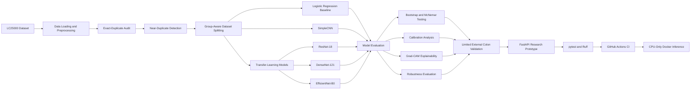
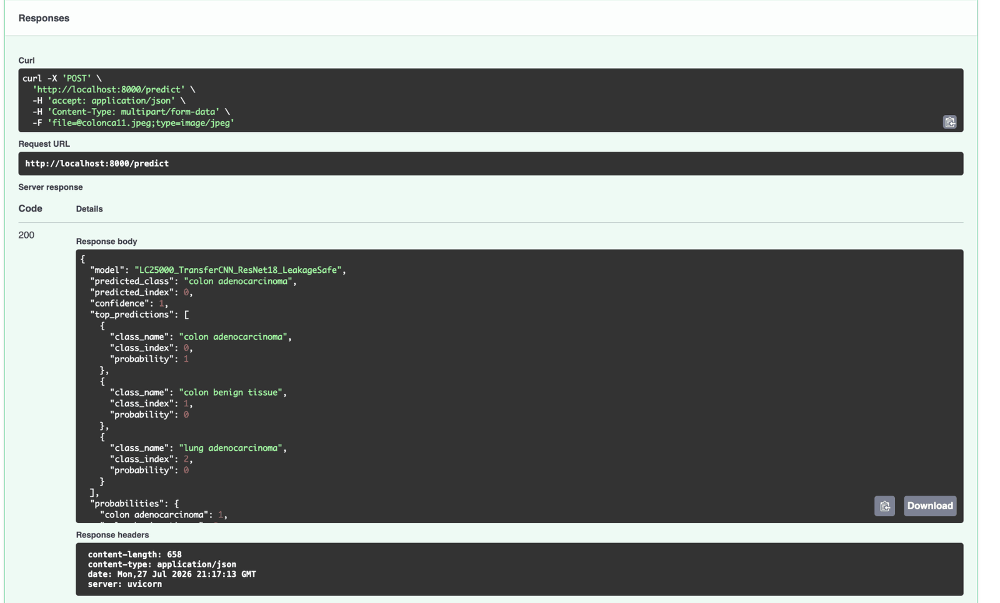

# Leakage-Safe Histopathology Classification on LC25000

[](https://github.com/abhishek04gautam-cpu/lc25000-leakage-safe-histopathology/actions/workflows/ci.yml)
[](https://www.python.org/)
[](https://pytorch.org/)
[](https://fastapi.tiangolo.com/)
[](Dockerfile)
[](LICENSE)

### Duplicate-aware deep-learning evaluation with robustness analysis, explainability, external colon validation and a containerised inference API

This repository contains the code, saved dataset splits, evaluation outputs and supporting artefacts from my MSc Artificial Intelligence dissertation at the University of East London.

The project investigates a key reliability question in medical-image classification:

> Can duplicate and near-duplicate histopathology image patches produce overly optimistic model-performance estimates?

Rather than reporting accuracy alone, the repository presents an end-to-end evidence chain covering data-leakage auditing, group-aware splitting, deep-learning evaluation, statistical testing, calibration, explainability, robustness, limited external validation, automated testing, CI and Docker-based API inference.

---

## 60-Second Project Review

| Area | Summary |
|---|---|
| Problem | Reliable five-class lung and colon histopathology classification |
| Primary dataset | LC25000 — 25,000 histopathology images |
| Reliability focus | Exact-duplicate and near-duplicate-aware evaluation |
| Models | Logistic Regression, SimpleCNN, ResNet-18, DenseNet-121 and EfficientNet-B0 |
| Best leakage-safe result | DenseNet-121 and EfficientNet-B0 achieved 1.0000 rounded accuracy |
| Selected deployable model | Leakage-safe ResNet-18 |
| Near-duplicate-safe result | ResNet-18 achieved 0.9992 macro F1 |
| External evaluation | CRC-VAL-HE-7K colon-restricted accuracy: 0.8582 |
| Statistical analysis | Bootstrap confidence intervals, paired bootstrap comparisons and McNemar tests |
| Responsible-AI analysis | Calibration, confidence, Grad-CAM, robustness and explicit clinical limitations |
| Engineering | FastAPI, Pydantic, pytest, Ruff, GitHub Actions and Docker |
| Deployment model | CPU-only Docker inference with a read-only mounted checkpoint |

### Reviewer shortcuts

- [Results overview](RESULTS_OVERVIEW.md)
- [Model card](MODEL_CARD.md)
- [FastAPI implementation](src/api.py)
- [Model definitions](src/model.py)
- [Automated tests](tests/)
- [CI workflow](.github/workflows/ci.yml)
- [Dockerfile](Dockerfile)
- [Saved splits](saved_splits/)
- [Leakage-audit evidence](leakage_audit/)
- [Machine-readable results](results_summary/)
- [Figures](figures/)

---

## Why This Repository Stands Out

- Audits exact and near-duplicate relationships before interpreting model performance
- Uses deterministic group-aware train, validation and test splits
- Compares classical, custom-CNN and transfer-learning baselines
- Preserves prediction-level outputs for paired statistical testing
- Reports confidence intervals rather than relying only on point estimates
- Evaluates calibration, temperature scaling, robustness and Grad-CAM explanations
- Includes limited independent colorectal validation to expose domain shift
- Provides a typed FastAPI inference service with input validation and research disclaimers
- Includes automated API and split-integrity tests
- Runs code-quality and test checks through GitHub Actions
- Provides a tested CPU-only Docker workflow with a read-only model mount
- Keeps datasets and trained weights outside Git while documenting the required paths and checksum

---

## Project Workflow



---

## Research Questions

The experimental framework addresses the following questions:

1. Does the initial LC25000 split contain exact or near-duplicate overlap between training and test data?
2. How does duplicate-aware splitting affect reported model performance?
3. Do high-performing models remain accurate after near-duplicate grouping?
4. Are performance differences between models statistically meaningful?
5. How confident and calibrated are the predictions?
6. Which image regions influence model decisions?
7. How robust is the selected model to realistic image perturbations?
8. How well does an LC25000-trained model transfer to an independent colorectal histology dataset?

---

## Dataset

### LC25000

The primary dataset contains 25,000 histopathology images across five balanced classes:

| Folder | Class |
|---|---|
| `colon_aca` | Colon adenocarcinoma |
| `colon_n` | Colon benign tissue |
| `lung_aca` | Lung adenocarcinoma |
| `lung_n` | Lung benign tissue |
| `lung_scc` | Lung squamous-cell carcinoma |

Images are resized to `224 × 224` RGB inputs for CNN training and inference.

The dataset is not redistributed in this repository. Download it from its original public source and place it under:

```text
datasets/
└── lc25000/
    └── <dataset subdirectories>
        ├── colon_aca/
        ├── colon_n/
        ├── lung_aca/
        ├── lung_n/
        └── lung_scc/
```

The loader searches recursively, so the five class folders may be nested inside the downloaded directory structure.

### External validation dataset

Limited external validation uses the following CRC-VAL-HE-7K classes:

| CRC-VAL-HE-7K class | Evaluation mapping |
|---|---|
| `TUM` | Tumour / LC25000 colon adenocarcinoma |
| `NORM` | Normal / LC25000 colon benign tissue |

This is a **colon-only external validation experiment**. It is not a complete external validation of all five LC25000 classes.

Expected structure:

```text
datasets/
└── crc-val-he-7k/
    └── CRC-VAL-HE-7K/
        ├── NORM/
        ├── TUM/
        └── <other CRC-VAL-HE-7K classes>
```

Alternatively:

```bash
export CRC_VAL_HE_7K_ROOT="/path/to/CRC-VAL-HE-7K"
```

---

## Evaluation Protocols

### 1. Initial stratified split

The initial experiment used a persisted stratified train, validation and test split. This protocol provided the starting benchmark but was subsequently audited for cross-split image overlap.

### 2. Exact-duplicate-aware leakage-safe split

Exact or effectively identical resized images were grouped before splitting to reduce train-test leakage.

| Partition | Samples |
|---|---:|
| Training | 17,510 |
| Validation | 3,761 |
| Test | 3,729 |

### 3. Near-duplicate-aware grouped split

Perceptual average hashing was used to identify highly similar image relationships. Related images were grouped before assignment to train, validation and test partitions.

| Partition | Samples |
|---|---:|
| Training | 17,480 |
| Validation | 3,745 |
| Test | 3,775 |

The current evaluation code labels this protocol as:

```text
near_duplicate_safe_average_hash_grouped_split
```

### Leakage-audit findings

The audit identified:

- **277 exact resized-image train-test overlaps** in the initial split
- **543 highly similar train-test relationships** at average-hash Hamming distance `≤ 2`

These findings motivated the stricter grouped evaluation protocols.

---

## Models Evaluated

### Classical baseline

#### Logistic Regression

- Images converted to grayscale
- Downsampled to `32 × 32`
- Flattened into feature vectors
- Used as a non-deep-learning baseline

### Deep-learning models

#### Custom SimpleCNN

A convolutional neural network trained from scratch to provide a deep-learning baseline without pretrained ImageNet features.

#### ResNet-18 staged fine-tuning

A pretrained ResNet-18 adapted to the five LC25000 classes. Training begins with selected layers frozen, followed by deeper fine-tuning.

#### ResNet-18 head-only ablation

The pretrained backbone remains frozen while only the classifier head is trained. This measures the value of deeper backbone adaptation.

#### DenseNet-121

A pretrained DenseNet-121 adapted and fine-tuned for five-class histopathology classification.

#### EfficientNet-B0

A pretrained EfficientNet-B0 adapted and fine-tuned for the same task.

---

## Training Configuration

| Parameter | Value |
|---|---|
| Image size | `224 × 224` |
| Random seed | `42` |
| LC25000 batch size | `24` |
| Horizontal flip probability | `0.5` |
| Rotation | `±10°` |
| Normalisation | ImageNet mean and standard deviation |
| Optimiser | AdamW |
| Model-selection metric | Macro F1 |
| Early-stopping patience | `8` |
| Bootstrap repetitions | `1,000` |
| Paired bootstrap repetitions | `2,000` |
| Calibration bins | `10` |

---

## Leakage-Safe Results

Results from the resized-image-hash-grouped leakage-safe split:

| Model | Accuracy | Macro F1 | Balanced Accuracy | ROC-AUC |
|---|---:|---:|---:|---:|
| Logistic Regression | 0.5433 | 0.5411 | 0.5430 | 0.8642 |
| SimpleCNN | 0.9901 | 0.9901 | 0.9901 | 0.9998 |
| ResNet-18 Head-Only | 0.9920 | 0.9920 | 0.9920 | 0.9999 |
| ResNet-18 Staged Fine-Tuning | 0.9992 | 0.9992 | 0.9992 | 1.0000 |
| DenseNet-121 | 1.0000 | 1.0000 | 1.0000 | 1.0000 |
| EfficientNet-B0 | 1.0000 | 1.0000 | 1.0000 | 1.0000 |

The transfer-learning models substantially outperformed the classical baseline. The difference between the head-only and staged ResNet-18 configurations also indicates that deeper fine-tuning improved performance.

### Example leakage-safe confusion matrix

<p align="center">
  
</p>

---

## Near-Duplicate-Safe Result

The ResNet-18 model evaluated on the stricter average-hash-grouped split achieved:

| Metric | Result |
|---|---:|
| Accuracy | 0.9992 |
| Weighted F1 | 0.9992 |
| Macro F1 | 0.9992 |
| Balanced accuracy | 0.9992 |
| ROC-AUC | 1.0000 |
| Test samples | 3,775 |

The continued high performance suggests that LC25000 remains highly separable after duplicate and near-duplicate mitigation. This result must still be interpreted cautiously because the dataset is patch-based rather than patient-based.

---

## Statistical Evaluation

The repository preserves:

- Bootstrap confidence intervals
- Paired bootstrap comparisons
- McNemar tests
- Per-model prediction files
- Class-level evaluation reports
- Confusion matrices
- ROC curves

Relevant outputs are stored under:

```text
results_summary/leakage_safe/
```

Key files include:

```text
all_leakage_safe_bootstrap_ci_summary.csv
mcnemar_results_leakage_safe.csv
paired_bootstrap_metric_differences_leakage_safe.csv
lc25000_leakage_safe_all_model_summary.csv
```

---

## Calibration and Confidence

High classification accuracy does not necessarily mean that predicted probabilities are reliable. The project therefore includes:

- Confidence-distribution analysis
- Expected Calibration Error
- Maximum Calibration Error
- Brier score
- Reliability diagrams
- Temperature scaling

Calibration figures are stored under:

```text
figures/calibration/
```

---

## Explainability with Grad-CAM

Grad-CAM was applied to the selected ResNet-18 model to inspect which image regions contributed most strongly to its predictions.

The repository includes examples for:

- Correctly classified images
- Misclassified images
- Multiple tissue classes

### Example Grad-CAM output

<p align="center">
  
</p>

Grad-CAM provides useful qualitative evidence, but it should not be interpreted as proof that the model is using clinically valid pathological features.

---

## Robustness Evaluation

The leakage-safe ResNet-18 model was evaluated under test-time perturbations including:

- Brightness changes
- Contrast changes
- Blur
- Noise
- Rotation

Brightness reduction produced the largest observed performance degradation among the tested perturbations.

Outputs are stored under:

```text
results_summary/robustness/
```

---

## Limited External Validation

The leakage-safe ResNet-18 checkpoint was evaluated on `1,974` CRC-VAL-HE-7K images:

| External class | Samples |
|---|---:|
| TUM | 1,233 |
| NORM | 741 |
| Total | 1,974 |

### Strict five-class interpretation

A prediction was considered correct only when:

- `TUM` was predicted as LC25000 colon adenocarcinoma
- `NORM` was predicted as LC25000 colon benign tissue

| Metric | Result |
|---|---:|
| Strict five-class external accuracy | 0.8308 |
| Non-colon prediction rate | 0.0329 |

### Colon-restricted binary interpretation

Only the two colon-class probabilities were compared:

| Metric | Result |
|---|---:|
| Accuracy | 0.8582 |
| Weighted precision | 0.8609 |
| Weighted recall | 0.8582 |
| Weighted F1 | 0.8545 |
| Macro F1 | 0.8418 |
| Balanced accuracy | 0.8296 |
| ROC-AUC | 0.9032 |

<p align="center">
  
</p>

The decline from internal LC25000 performance to external performance demonstrates the importance of domain shift and independent evaluation.

This experiment covers only two colorectal classes and must not be presented as full external validation of the five-class model.

---

## FastAPI Research Prototype

The API accepts a histopathology image and returns:

- Predicted class
- Confidence score
- Top-three predictions
- Per-class probabilities
- Model identifier
- Explicit research and clinical disclaimer

### Endpoints

| Method | Endpoint | Purpose |
|---|---|---|
| `GET` | `/health` | Service, device and model status |
| `POST` | `/predict` | Validated image classification |
| `GET` | `/docs` | Interactive OpenAPI documentation |

The service includes checks for:

- Missing or empty uploads
- Unsupported media types
- Invalid image content
- Maximum upload size
- Missing model checkpoint

The model is loaded once during application startup and inference uses `torch.inference_mode()`.

### Run locally

Place the trained checkpoint at:

```text
models/LC25000_TransferCNN_ResNet18_LeakageSafe.pth
```

Start the API:

```bash
python -m uvicorn api:app   --app-dir src   --host 0.0.0.0   --port 8000
```

Health check:

```bash
curl -i http://localhost:8000/health
```

Prediction request:

```bash
curl -i -X POST   -F "file=@path/to/histopathology_image.jpeg;type=image/jpeg"   http://localhost:8000/predict
```

Interactive documentation:

```text
http://localhost:8000/docs
```

### Example response

```json
{
  "model": "LC25000_TransferCNN_ResNet18_LeakageSafe",
  "predicted_class": "lung adenocarcinoma",
  "predicted_index": 2,
  "confidence": 1.0,
  "top_predictions": [
    {
      "class_name": "lung adenocarcinoma",
      "class_index": 2,
      "probability": 1.0
    }
  ],
  "disclaimer": "Research prototype only. This output is not a clinical diagnosis and must not be used without expert pathological review."
}
```

This is an example research output, not a clinical interpretation.

### Example Swagger UI prediction

<p align="center">
  
</p>

<p align="center">
  <em>Example research-prototype response. This output is not a clinical diagnosis.</em>
</p>

---

## Model Checkpoint

The trained checkpoint is intentionally excluded from Git because it is a large binary artefact.

Expected path:

```text
models/LC25000_TransferCNN_ResNet18_LeakageSafe.pth
```

Verified SHA-256 checksum:

```text
7e55baa06af27d2e6188933e539e0d9a759ffe6a9f0939a326055fab87adecbf
```

Verify a local copy:

```bash
shasum -a 256 models/LC25000_TransferCNN_ResNet18_LeakageSafe.pth
```

The checkpoint corresponds to the leakage-safe ResNet-18 used for the reported internal analysis and limited external colon validation.

The repository does not currently redistribute the trained weight file. Reproduce it through the documented training pipeline or obtain the matching artefact separately before starting the API.

---

## Docker Deployment

The repository includes a tested CPU-only Docker workflow.

The image:

- Uses Python 3.12 slim
- Installs CPU-only PyTorch
- Excludes datasets, results, virtual environments and model binaries from the build context
- Loads the complete trained checkpoint without downloading ImageNet weights at API startup
- Mounts the checkpoint directory read-only

### Build

```bash
docker build -t lc25000-api:latest .
```

### Run

From the repository root:

```bash
docker run --rm --name lc25000-api   -p 8000:8000   -v "$(pwd)/models:/app/models:ro"   lc25000-api:latest
```

### Smoke test

In a second terminal:

```bash
curl -i http://localhost:8000/health
```

Then submit an image:

```bash
curl -i -X POST   -F "file=@path/to/histopathology_image.jpeg;type=image/jpeg"   http://localhost:8000/predict
```

Stop the container with `Control + C`.

---

## Automated Tests and Continuous Integration

The current pytest suite covers:

- Valid image-upload acceptance
- Invalid image-content rejection
- Unsupported media-type rejection
- Empty-upload rejection
- Non-overlapping saved train, validation and test indices
- Availability of persisted split artefacts

Run locally:

```bash
python -m pytest tests -v
```

Run Ruff:

```bash
python -m ruff check src/api.py src/model.py tests
```

GitHub Actions automatically installs the development dependencies and runs code-quality and test checks on repository updates.

Workflow:

```text
.github/workflows/ci.yml
```

---

## Repository Structure

```text
.
├── .github/
│   └── workflows/
│       └── ci.yml
│
├── docs/
│   └── Supporting documentation
│
├── figures/
│   ├── calibration/
│   ├── confusion_matrices/
│   ├── external_validation/
│   ├── gradcam/
│   └── leakage_safe/
│
├── leakage_audit/
│   └── Duplicate and near-duplicate audit artefacts
│
├── results/
│   └── Experimental outputs
│
├── results_summary/
│   ├── external_validation/
│   ├── leakage_safe/
│   ├── near_duplicate_safe/
│   └── robustness/
│
├── saved_splits/
│   └── Persisted train, validation and test indices
│
├── src/
│   ├── data/
│   ├── api.py
│   ├── bootstrap_ci.py
│   ├── calibration_analysis.py
│   ├── confidence_analysis.py
│   ├── config.py
│   ├── data_loader.py
│   ├── dataset.py
│   ├── download_lc25000_dataset.py
│   ├── generate_lc25000_dissertation_figures.py
│   ├── gradcam_lc25000.py
│   ├── imbalance_audit.py
│   ├── lc25000_classical_baseline.py
│   ├── lc25000_external_crc_validation.py
│   ├── lc25000_leakage_audit_v2.py
│   ├── lc25000_leakage_safe_split.py
│   ├── lc25000_near_duplicate_safe_split.py
│   ├── lc25000_sample_grid.py
│   ├── main.py
│   ├── model.py
│   ├── model_efficiency_analysis.py
│   ├── run_lc25000_leakage_safe_evaluation.py
│   ├── run_lc25000_near_duplicate_safe_evaluation.py
│   ├── statistical_comparison_leakage_safe.py
│   ├── temperature_scaling.py
│   ├── train.py
│   └── visualization.py
│
├── tests/
│   ├── test_api_validation.py
│   └── test_split_integrity.py
│
├── .dockerignore
├── CITATION.cff
├── Dockerfile
├── LICENSE
├── pytest.ini
├── README.md
├── RESULTS_OVERVIEW.md
├── requirements.txt
├── requirements-dev.txt
└── requirements-lock.txt
```

The `models/` and `datasets/` directories are expected locally but are excluded from version control.

---

## Installation

Python `3.12` is recommended.

### Clone

```bash
git clone https://github.com/abhishek04gautam-cpu/lc25000-leakage-safe-histopathology.git
cd lc25000-leakage-safe-histopathology
```

### Create a virtual environment

macOS or Linux:

```bash
python3.12 -m venv .venv
source .venv/bin/activate
```

Windows PowerShell:

```powershell
py -3.12 -m venv .venv
.venv\Scripts\Activate.ps1
```

### Install runtime dependencies

```bash
python -m pip install --upgrade pip
python -m pip install -r requirements.txt
```

### Install development dependencies

```bash
python -m pip install -r requirements-dev.txt
```

`requirements-lock.txt` preserves the fuller captured environment used for reproducibility and dependency inspection.

---

## Dataset Setup

Download or prepare LC25000:

```bash
python src/download_lc25000_dataset.py
```

Alternatively, manually place it under:

```text
datasets/lc25000/
```

Confirm that these folders can be found recursively:

```text
colon_aca
colon_n
lung_aca
lung_n
lung_scc
```

---

## Running the Experiments

### Compile-check the source files

```bash
python -m py_compile $(find src -name "*.py")
```

### Run the main experiment pipeline

```bash
python src/main.py
```

### Run the classical baseline

```bash
python src/lc25000_classical_baseline.py
```

### Audit exact and near-duplicate overlap

```bash
python src/lc25000_leakage_audit_v2.py
```

### Create the exact-duplicate-aware leakage-safe split

```bash
python src/lc25000_leakage_safe_split.py
```

### Create the near-duplicate-aware split

```bash
python src/lc25000_near_duplicate_safe_split.py
```

### Run leakage-safe evaluations

```bash
python src/run_lc25000_leakage_safe_evaluation.py --model logistic
python src/run_lc25000_leakage_safe_evaluation.py --model simplecnn
python src/run_lc25000_leakage_safe_evaluation.py --model resnet18
python src/run_lc25000_leakage_safe_evaluation.py --model headonly
python src/run_lc25000_leakage_safe_evaluation.py --model densenet121
python src/run_lc25000_leakage_safe_evaluation.py --model efficientnetb0
```

### Run near-duplicate-safe evaluation

```bash
python src/run_lc25000_near_duplicate_safe_evaluation.py --model resnet18
```

### Run statistical comparisons

```bash
python src/statistical_comparison_leakage_safe.py
python src/bootstrap_ci.py
```

### Run confidence and calibration analysis

```bash
python src/confidence_analysis.py
python src/calibration_analysis.py
python src/temperature_scaling.py
```

### Generate Grad-CAM outputs

```bash
python src/gradcam_lc25000.py
```

### Analyse model efficiency

```bash
python src/model_efficiency_analysis.py
```

### Run external colon validation

Place CRC-VAL-HE-7K in the expected location or set `CRC_VAL_HE_7K_ROOT`, then ensure that the trained checkpoint is present at:

```text
models/LC25000_TransferCNN_ResNet18_LeakageSafe.pth
```

Run:

```bash
python src/lc25000_external_crc_validation.py
```

---

## Reproducibility

The repository supports reproducibility through:

- Fixed random seed
- Persisted split indices
- Saved model-level predictions
- Saved metric summaries
- Classification reports
- Statistical comparison outputs
- Confusion matrices and ROC curves
- Leakage-audit artefacts
- Calibration outputs
- Grad-CAM examples
- External-validation prediction tables
- Dependency specifications
- Checkpoint checksum
- Automated tests
- Continuous integration
- Containerised CPU inference

Saved splits should be reused when comparing models. Generating new random splits may produce results that are not directly comparable with the published repository outputs.

---

## Key Interpretation

The main conclusion is not simply that the models achieved high internal accuracy.

The more important findings are:

1. The initial split contained exact and highly similar cross-split images.
2. Duplicate-aware evaluation remained extremely strong.
3. Transfer learning substantially outperformed the classical baseline.
4. Deeper fine-tuning improved on the frozen-backbone ablation.
5. Internal LC25000 results did not fully transfer to an independent colorectal dataset.
6. Very high patch-level accuracy should not be interpreted as patient-level or clinical performance.
7. External validation and patient-level data remain necessary before real-world use.

---

## Limitations

Important limitations include:

- LC25000 is a patch-based rather than patient-based dataset
- Patient identifiers are unavailable
- Morphological redundancy may remain after perceptual-hash grouping
- Images may contain dataset-specific visual shortcuts
- Demographic and clinical metadata are limited
- Stain and acquisition differences may affect generalisation
- External evaluation covers only two colorectal classes
- Lung classes have not been independently externally validated
- No prospective clinical evaluation was performed
- No pathologist-reader study was conducted
- The FastAPI and Docker components are research prototypes, not production medical systems
- The trained checkpoint is not currently redistributed through the repository
- The Docker workflow has been smoke-tested locally but is not a regulated deployment process

The internal results must therefore be interpreted as benchmark performance under the documented experimental conditions.

---

## Responsible-AI and Clinical Disclaimer

This repository is intended for research, education and software-engineering demonstration only.

The models and outputs:

- Are not medical devices
- Are not clinically approved
- Are not diagnostic systems
- Must not be used to make patient-care decisions
- Must not be used without qualified pathological review
- Have not been prospectively validated in a healthcare setting

Model predictions may be wrong, overconfident or affected by dataset shift.

---

## Future Work

Potential extensions include:

- Patient-level dataset splitting
- Independent lung-histopathology validation
- Wider multicentre external validation
- Cross-dataset transfer evaluation
- Stain-normalisation experiments
- Self-supervised histopathology pretraining
- Uncertainty-aware prediction and abstention
- Out-of-distribution detection
- Model monitoring and drift detection
- Automated container-build validation in CI
- Hosted demonstration with controlled resource limits
- Model-card and data-card documentation
- MLflow experiment tracking
- Cloud deployment
- Pathologist-in-the-loop evaluation

---

## Technology Stack

### Machine learning and deep learning

- Python
- PyTorch
- torchvision
- scikit-learn
- NumPy
- pandas
- SciPy
- statsmodels

### Image processing and visualisation

- Pillow
- OpenCV
- Matplotlib
- Grad-CAM

### API, quality and deployment

- FastAPI
- Uvicorn
- Pydantic
- REST API
- Multipart image upload
- pytest
- pytest-cov
- Ruff
- GitHub Actions
- Docker

### Evaluation

- Accuracy
- Precision
- Recall
- Weighted F1
- Macro F1
- Balanced accuracy
- ROC-AUC
- Bootstrap confidence intervals
- Paired bootstrap comparison
- McNemar testing
- Expected Calibration Error
- Brier score
- Reliability diagrams

---

## Results and Supporting Material

| Resource | Location |
|---|---|
| Concise project results | [`RESULTS_OVERVIEW.md`](RESULTS_OVERVIEW.md) |
| Machine-readable summaries | [`results_summary/`](results_summary/) |
| Visual outputs | [`figures/`](figures/) |
| Leakage-audit evidence | [`leakage_audit/`](leakage_audit/) |
| Saved split artefacts | [`saved_splits/`](saved_splits/) |
| Automated tests | [`tests/`](tests/) |

---

## References

1. Borkowski, A. A., Bui, M. M., Thomas, L. B., Wilson, C. P., DeLand, L. A., & Mastorides, S. (2019). *Lung and Colon Cancer Histopathological Image Dataset (LC25000)*. https://arxiv.org/abs/1912.12142

2. Kather, J. N., Halama, N., & Marx, A. (2018). *100,000 Histological Images of Human Colorectal Cancer and Healthy Tissue*. Zenodo. https://doi.org/10.5281/zenodo.1214456

3. He, K., Zhang, X., Ren, S., & Sun, J. (2015). *Deep Residual Learning for Image Recognition*. https://arxiv.org/abs/1512.03385

4. Huang, G., Liu, Z., van der Maaten, L., & Weinberger, K. Q. (2016). *Densely Connected Convolutional Networks*. https://arxiv.org/abs/1608.06993

5. Tan, M., & Le, Q. V. (2019). *EfficientNet: Rethinking Model Scaling for Convolutional Neural Networks*. https://arxiv.org/abs/1905.11946

6. Selvaraju, R. R., Cogswell, M., Das, A., Vedantam, R., Parikh, D., & Batra, D. (2016). *Grad-CAM: Visual Explanations from Deep Networks via Gradient-Based Localization*. https://arxiv.org/abs/1610.02391

---

## Citation

Citation metadata is provided in:

```text
CITATION.cff
```

When using this software or its experimental outputs, cite the repository and, when available, the accompanying research manuscript.

---

## Licence

This project is released under the [MIT License](LICENSE).

---

## Author

**Abhishek**

AI and Machine Learning Engineer  
MSc Artificial Intelligence with Distinction  
Former Software Engineer at HCL Technologies

- LinkedIn: https://www.linkedin.com/in/abhishek-b98059240
- GitHub: https://github.com/abhishek04gautam-cpu
- Email: abhishek.gautam.1895@gmail.com

---

## Project Status

- MSc dissertation completed
- Exact-duplicate leakage audit completed
- Leakage-safe experiments completed
- Near-duplicate-aware evaluation completed
- Statistical analysis completed
- Calibration and explainability analysis completed
- Robustness analysis completed
- Limited external colon validation completed
- FastAPI research prototype completed
- Automated tests completed
- GitHub Actions CI completed
- CPU-only Docker build and inference smoke test completed
- Research manuscript in preparation
